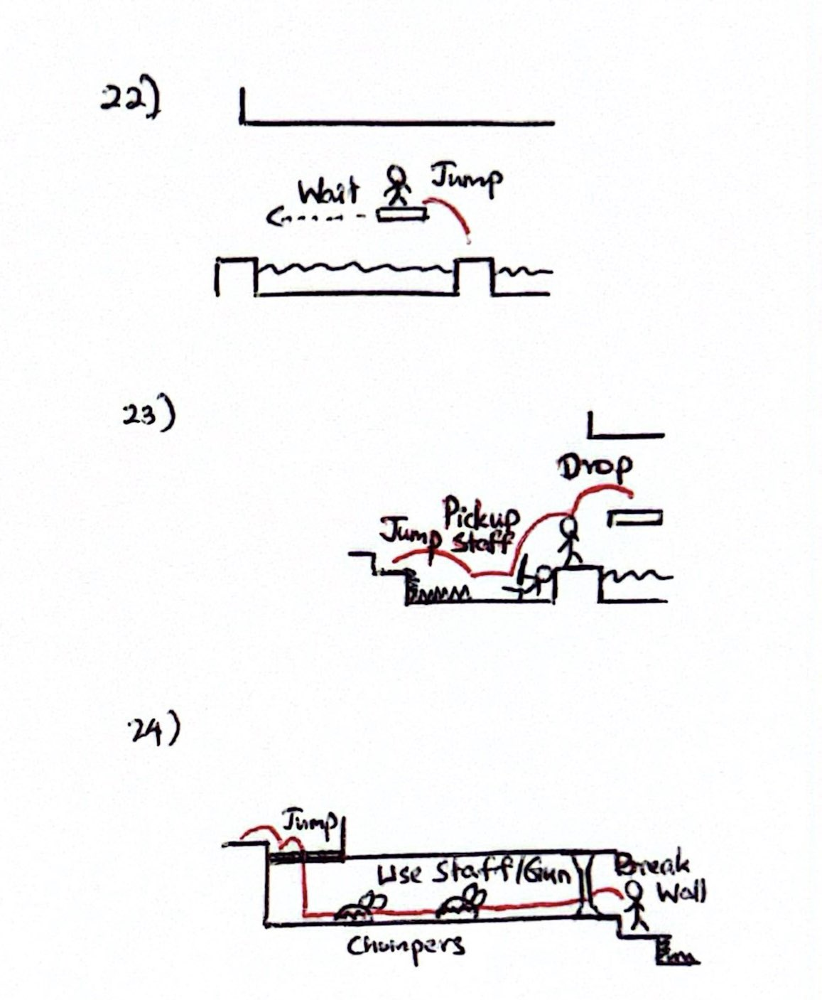
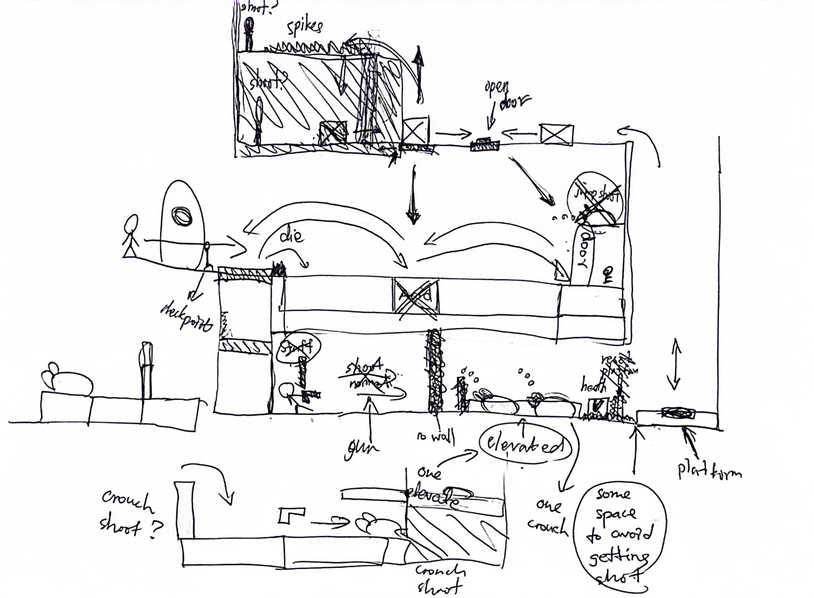

# COMP2150  - Level Design Document
### Name: Htet Yamin Ei
### Student number: 47743220

## 1. Player Experience

### 1.1. Discovery

New mechanics and elements are progressively introduced to players so that they can learn and adapt to each new challenge at their own pace. Players are encouraged to explore and learn about the functionality of objects through encounters, fostering a sense of agency and curiosity.

In the above picture, players encounter a section where they discover the checkpoint, a platform which they can pass through, and the fact that acid pools trigger a respawn at the last checkpoint. 

As depicted in the picture, players encounter a skeleton equipped with a gun and an enemy spitter. The player discovers that they can pick up the gun and learn how to shoot it to kill the spitter. The first spitter is placed in a location where players can observe its behaviour without immediate danger. The player learns to dodge the spitter's projectiles through trial and error.

In this part, the player learns that health can be restored with a health pickup box, and the pressure pad can be used to move the platform. The health pickup boxes are visually distinct, drawing their attention.

In this section, the player is introduced to a big pushable box, spikes that cause damage upon contact, and a switch that can be triggered with the bullet. The sound of a switch being triggered signals to the player that a door has opened. Such visual and audio cues provide feedback to players, reinforcing learning and guiding them through the discovery process.

As seen in the image, the player is exposed to the mechanics that pushable boxes can float on the acid.

As shown in the picture, the player comes across a staff that can be taken from the skeleton and encounters a destructible wall, which forces them to use the staff to destroy the obstacle in their path.

In this part, the player is introduced to chompers, which move towards them to deal damage upon contact. The player learns that they can be destroyed by using the staff as a melee weapon.

### 1.2. Drama

The intensity curve is designed to gradually increase, providing players with moments of tension and relief throughout their journey. More challenging hazards and enemies are introduced over time.

In the picture shown above, players must navigate through a series of platforms suspended over spikes at the bottom while avoiding spitters and moving spikes. The cramped quarters and constant threat of falling create a sense of tension for players. Reaching the checkpoint afterward provides moments of relief and respite. The combination of moving platform challenges and spitters keeps players engaged and invested in the gameplay, while the occasional presence of stationary platforms ensures that the difficulty remains manageable, and players feel a sense of progression.

### 1.3. Challenge

The main challenges revolve around navigating hazards, defeating enemies, solving puzzles, and mastering platforming mechanics. The difficulty curve is carefully balanced to keep players in the flow channel, with each new challenge building upon the skills learned in previous levels. Players must learn to anticipate movements and attacks of spitters and chompers, as well as develop strategies for defeating them efficiently while minimizing damage taken. Timing, precision, and spatial awareness for spikes and acid pools are crucial for avoiding damage and progressing through the level safely. Obstacles such as locked doors and large acid pools encourage problem-solving skills. Visual indicators of damage taken or the consequences of failing to navigate a hazard help the player understand the impact of their actions and adjust their strategies accordingly. This iterative process of learning and adaptation is essential for maintaining flow and preventing frustration.

In the above picture, the player must trigger the switch to unlock the door to get the key. However, the switch and the door are guarded by two spitters. Combining enemy encounters with puzzle-solving elements provides a meaningful test of the player's abilities without feeling overly punishing or unfair.

### 1.4. Exploration

The level is filled with interactive elements such as switches, movable objects, and destructible walls, creating opportunities for exploration and experimentation. Visual cues and environmental aesthetics of the level create memorable spaces and places. After picking up the gun, the player can choose to go back to the left side of the game world or continue to the right.

As seen in the picture, the player encounters a seemingly dead-end with a suspicious-looking cracked wall. Upon closer inspection, they notice cracks in the wall, hinting at its destructible nature. By using the staff, which they acquired earlier, they can break through the cracked wall to move forward. This example demonstrates how exploration is encouraged through environmental cues and interactive elements. 

## 2. Core Gameplay

### 2.1. Acid & Checkpoints

The player passes by a glowing checkpoint marker for the first time and reaches a pool of bubbling green acid. They jump into the acid and lose 1 health point, prompting them to respawn at the last checkpoint. Introducing the concept of acid early in the game emphasises the importance of environmental hazards and teaches players to avoid them to progress safely.

### 2.2. Passthrough Platforms

After respawning, the player must figure out a way to progress. They stand on a slightly different platform and notice that they can pass through it. Early introduction of passthrough platforms adds depth to level design and inspires players to think creatively.

### 2.3. Weapon Pickup (Gun)

Moving forward, the player discovers a gun pickup from the skeleton. They pick up the gun. By introducing a spitter right after the gun pickup, players are forced to learn how to shoot the gun.

### 2.4. Spitters

Afterwards, the player is met with a group of spitters to introduce combined mechanics such as jumping and shooting & crouching and shooting. 

### 2.5. Health Pickups

Once the player kills the spitters, a health pickup is presented to them to restore one health point if they take damage from the spitter, rewarding their victory. 

### 2.6. Spikes

If the player continues to jump on the spikes to get near the switch, they will take damage and lose one health point. By placing spikes there, players are forced to use the jumping and shooting mechanics to trigger the switch. This introduction of spikes reinforces the importance of precision and careful movement in navigating through the level later.

### 2.7. Keys

As seen in the picture, players must kill the spitter guarding the switch to open the door and collect the key. This placement of spitters adds a strategic layer since they must time their shooting and movements to avoid the spitter's projectiles. After defeating the spitter and opening the door, the player is rewarded with a health pickup and a key to encourage positive feedback loops.  

### 2.8. Moving Platforms

Along the path, the player encounters two moving platforms suspended over two acid pools. They must carefully time their jumps to avoid falling into the acid pools. This introduction of moving platforms early in the game allows players to become familiar with platforming mechanics that will be more complex later in the game.

### 2.9. Weapon Pickup (Staff) & Chompers

As shown in the picture, the player picks up a staff from the skeleton and is introduced to to a breakable wall and chompers, forcing them to use the staff. They must destroy the wall and kill in the chompers to continue their path. If they fail to do so, the chompers will deal one damage point upon contact. This element placement encourages them to explore the tools in the game.

## 3. Spatiotemporal Design
 
### 3.1. Molecule Diagram

### 3.2. Level Map – Section 1

### 3.3. Level Map – Section 2

### 3.4. Level Map – Section 3

## 4. Iterative Design
Reflect on how iterative design helped to improve your level. Additional prototypes and design artefacts should be included to demonstrate that you followed an iterative design process (e.g. pictures of paper prototypes, early grey-boxed maps, additional storyboards of later gameplay sequences, etc.). You can also use this section to justify design changes made in Unity after you drew your level design maps shown in section 3. 

You should conclude by highlighting a specific example of an encounter, or another aspect of your level design, that could be improved through further iterative design.

Iterative design played a crucial role in refining and improving the overall quality of the level design. Through iterative testing and making iterative adjustments, I was able to identify and address problems, improve player experience, and eventually produce a more enjoyable gameplay environment.

I started the design process by sketching the design layouts, enemy placements, and interactive items as shown in the above pictures. Those sketches helped me to explore various design ideas and visualise potential challenges before the implementation in Unity. After the implementing in Unity, I playtested multiple times to pinpoint areas for improvement throughout the whole process. I made some adjustments to the level design based on the findings during playtesting. This involved changing the position of enemies, adjusting platform layouts, and optimising the gameplay. I discovered that the placement of several enemies may frustrate players based on results from early playtesting sessions. In response, I moved the spitters and chompers around to provide players more strategic ways to interact with them while maintaining a fair and balanced encounter experience.

The significance of adjusting difficulty to account for varying skill levels was one of the most important lessons discovered during the development process. I was able to see the significance of delivering a gradual learning curve and modifying difficulty levels based on user skill levels. I also discovered the value of incorporating moments of rest and relaxation between intense gameplay segments. By strategically placing checkpoints and safe zones throughout the level, I was able to create a more balanced pacing that allowed players to recover after challenging encounters.

The pacing of enemy encounters and the speed of moving platforms in this part could be further improved through iterative design. Both spike and spitter encounters may be somewhat difficult or overwhelming for some players, leading to frustration. Moreover, I also want to investigate new gameplay mechanics and level components that can improve player immersion and engagement even more. Through constant exploration and iteration, I aim to keep improving the level design.

## Generative AI Use Acknowledgement

### Tool Used: ChatGPT 3.5
**Nature of Use** Checking grammar mistakes and correcting punctuations.

**Evidence Attached?** Screenshot of ChatGPT conversation included in the folder "GenAI" in this repo.

**Additional Notes:** I used ChatGPT to check grammar mistakes and to correct punctuations. I read through the suggestions and incorporated some of the phrasing into my writing.
